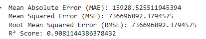
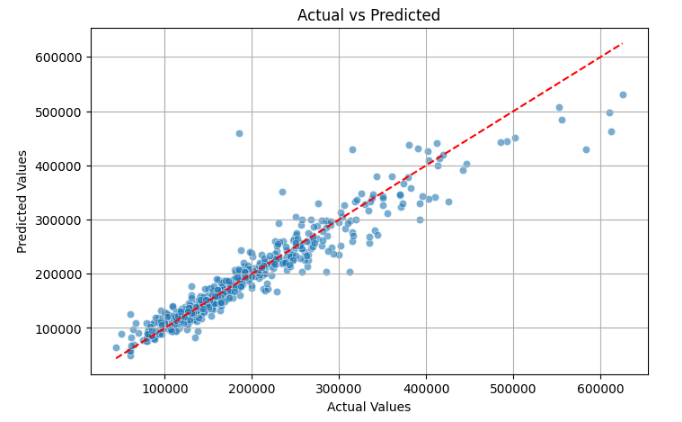
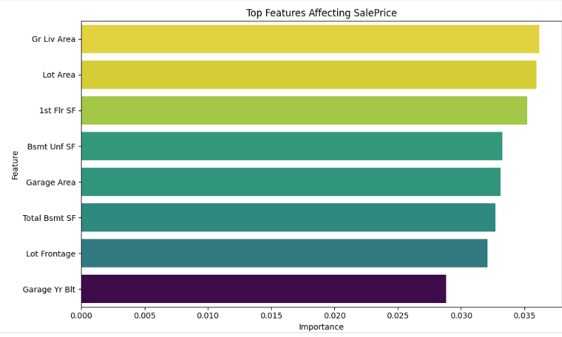

# 🏠 Ames Housing - Predicting Sale Prices using Random Forest

This project uses the **Ames Housing dataset** to predict house sale prices using a Random Forest model in Python.

---

## 📁 Dataset Source

Dataset used: [Kaggle - Ames Housing Dataset](https://www.kaggle.com/datasets/prevek18/ames-housing-dataset/data)

---

## 📌 Project Steps

The project follows these steps:

1. Load and explore the dataset
2. Clean missing and duplicated values
3. Encode categorical variables
4. Perform feature engineering
5. Train a Random Forest Regressor model
6. Evaluate the model
7. Visualize feature importance and predictions

---

## 🧩 Function Descriptions

### `load_data(path)`
Loads the CSV file and returns a pandas DataFrame.

### `explore_data(df)`
Prints:
- First 5 rows
- Data info (dtypes, nulls)
- Descriptive stats
- Count of missing values

### `clean_data(df)`
- Fills missing numeric values with the mean
- Fills missing categorical values with the mode (or `"Unknown"` if empty)
- Drops duplicates

### `preprocessing_data(df)`
- Encodes all categorical columns using `LabelEncoder`

### `feature_engineering(df)`
- Keeps only selected columns relevant for prediction:
  - Examples: `'Gr Liv Area'`, `'Lot Area'`, `'Garage Area'`, `'Year Built'`, `'SalePrice'`, etc.

### `model_training(df)`
- Splits the dataset into training and test sets
- Trains a `RandomForestRegressor`
- Returns the trained model, `X_test`, and `y_test`

### `evaluate_model(model, X_test, y_test)`
- Predicts using the model and prints:
  - MAE (Mean Absolute Error)
  - MSE (Mean Squared Error)
  - RMSE (Root Mean Squared Error)
  - R² Score
- Plots a scatterplot: **Actual vs Predicted Sale Prices**
- 

## `plot_top_features()`
- Plots a bar chart of 8 pre-selected most important features (based on domain knowledge or testing)

---


```

---

## 📊 Required Libraries

Make sure to install the following libraries before running the script:

```bash
pip install pandas seaborn matplotlib scikit-learn
```

---

## ▶️ Run the Full Pipeline

To run everything, just call the `main()` function:

```python
main()
```

It will:
- Load the data
- Clean it
- Encode categorical features
- Select important features
- Train the model
- Evaluate results
- Plot visualizations

---

## 📈 Visualizations

### Actual vs Predicted Sale Prices

> Scatterplot comparing predicted values to actual house sale prices.



### Top 8 Important Features

> Bar plot showing the 8 features with highest importance.


